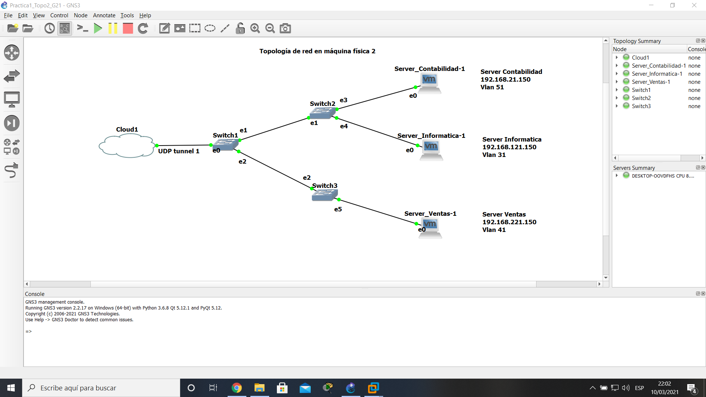

# **MANUAL DE CONFIGURACION**
## Topología 1
Pasos para configurar la topologia 1.
### Añadir maquina virtual de VMware:
- En GNS3 en la pestaña editar hay que seleccionar el boton preferencias, seleccionar la opcion VMware Y en la pestaña "Advance local settings" configurar cuantos vmnet interfaces se usaran.

  

- Crear la maquina virtual en VMware y configurar el network adapter para que utilice una de las interfaces vmnet previamente configuradas. 

  

- En GNS3 en la ventana de preferencias seleccionar la opcion VMware VMs y seleccionar nuevo, en la nueva ventana buscar la maquina virtual a utilizar y marcar la opcion "Use as linked base VM" para poder utilizar esa misma maquina varias veces.

  

- En la pestaña VMware VMs se podra ver la maquina virtual, seleccionar "type" el cual se encuentra en network y presionar editar, en la nueva ventana ir a la pestaña network y cambiar la opcion type a vmxnet3.

  

- Ahora podra usar la maquina virtual en su topologia.
 ### Diseñar la topologia
- Se utilizaran 3 vpcs, 3 maquinas virtuales, 4 switch y un cloud. 
- Se debe configurar el nombre de cada host.
- Unir cada host con su respectivo switch.

  

### Configurar host
- Encender la vpc, abrir la ventana de comandos, utilizar el comando "ip 'tu ip'/'tu gateway' 'tu puerta de enlace'".

  

- ingresar el comando save para guardar los cambios y repetir el proceso con todas las vpc.

  

- Encender la maquina virtual, ir a "conexiones de red", entrar en Local area conection, ir a propiedades, ir a protocolo de internet(TCP/IP) y modificar la ip.

  

  

- En este punto ya todos los hosts fueron configurados

### Configurar switch
- Hacer click en el switch, para configurar el puerto conectado a un host colocar el puerto a modificar en port, colocar la VLAN en VLAN y seleccionar aplicar.
- En la misma ventana, para configurar el puerto conectado a otro switch o cloud, colocar el puerto a modificar en port, en type seleccionar dot1q y seleccionar aplicar.

  

## Topología 2
Pasos para configurar la topologia 2.
### Agregar las máquinas virtuales:
- Para esta topologia se usarán 3 maquinas virtuales con el sistema Operativo Ubuntu 16.04 LTS, se proceden a agregar de la misma manera que se explicó en la topologia 1.Para este caso se usarán como servidores los cuales uno será para la VLAN del área de Contabilidad, otra para el área de Informática y otra para Ventas.

- Ya al agregar las 3 máquinas  en la seccion de VMWare nos muestra las 3 maquinas que agregamos

  

### Diseño de la topología:
- Se utilizaran 3 maquinas virtuales, 3 switch y un cloud. 
- Se debe configurar el nombre de cada servidor.
- Unir cada servidor con su respectivo switch.

Cabe destacar que las conexiones entre los switches se realizan en modo dot1q y entre switch-server en modo acceso.

  

### Configuración de los Servers:

- Procederemos a configurar el Server-Contabilidad, para esto hacemos click sobre la maquina virtual y luego Start para encenderla.

  

- Nos vamos a System Settings y luego click en Network

  

- Configuramos Wired Connection 1 y cambiamos "Automatic (DHCP)" a "Manual"

  

- Como siguiente paso le damos click en Add y agregamos la direccion IP que le queremos asignar a la maquina, en este caso es la 192.168.21.150 con gateway para 192.168.21.1

  

- Verificamos que los cambios se guardaron ejecutando el comando ifconfig desde la terminal.

  

### Python 2 HTTP Server:

- En la máquina virtual procedemos a crear una carpeta que se llamará Conta en la cual levantaremos el HTTP Server, cabe recordar que el sistema operativo Ubuntu 16.04 LTS ya trae instalado python. A esta carpeta le creamos un archivo index.html con el contenido html a mostrar, luego procedemos a levantar el servidor con el siguiente comando: sudo python -m SimpleHTTPServer. Por defecto ya trae el puerto 8000 para levantar el servidor pero se lo podemos cambiar al que deseemos.

  

